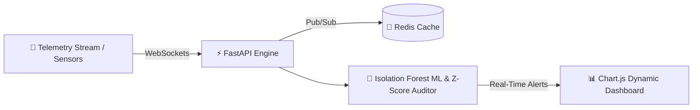

# PulseGrid AI ⚡

<div align="center">
  <h3>High-Frequency Real-Time Streaming Analytics & Anomaly Detection</h3>
  <p><em>Analyse en Flux Temps Réel Haute Fréquence & Détection d'Anomalies</em></p>

  <br />
  
  <!-- Demonstration Banner -->
  <div style="border: 1px solid rgba(255,255,255,0.2); border-radius: 12px; padding: 10px; background: rgba(0,0,0,0.5);">
    
    <p><sub>🎬 <b>Demonstration / Aperçu Visuel :</b> Remplacez <code>preview.gif</code> par la vraie démo animée du projet.</sub></p>
  </div>

  <br />
      
</div>

---

<details open>
  <summary><b>📌 Table of Contents / Table des matières</b></summary>
  <ul>
    <li><a href="#-english">🇬🇧 English</a></li>
    <ul>
      <li><a href="#-about-the-project">About the Project</a></li>
      <li><a href="#-architecture--data-flow">Architecture & Data Flow</a></li>
      <li><a href="#-key-features">Key Features</a></li>
      <li><a href="#-getting-started">Getting Started</a></li>
    </ul>
    <li><a href="#-français">🇫🇷 Français</a></li>
    <ul>
      <li><a href="#-à-propos-du-projet">À propos du projet</a></li>
      <li><a href="#-architecture--flux-de-données">Architecture & Flux de données</a></li>
      <li><a href="#-fonctionnalités-clés">Fonctionnalités clés</a></li>
      <li><a href="#-démarrage-rapide">Démarrage rapide</a></li>
    </ul>
    <li><a href="#-license--licence">📜 License / Licence</a></li>
  </ul>
</details>

---

## 🇬🇧 English

### 📖 About the Project
PulseGrid AI is a high-frequency real-time streaming analytics engine designed to process telemetry streams, detect statistical & ML anomalies via Isolation Forest and Z-Score algorithms, and broadcast alerts via low-latency WebSockets.

### 🏗️ Architecture & Data Flow


### ✨ Key Features
- ⚡ **Low-Latency Streaming**: Bi-directional WebSocket communication pipeline
- 🧠 **ML Anomaly Detection**: Unsupervised Isolation Forest & statistical Z-Score confidence scoring
- 📊 **Dynamic Dashboard**: Live telemetry charting powered by Chart.js & WebGL
- 🐳 **Dockerized Architecture**: Redis caching layer with pub/sub scaling capabilities

### 💻 Getting Started
To install and run this project locally:
```bash
python -m venv venv
venv\Scripts\activate
pip install -r requirements.txt
python app.py
```

---

## 🇫🇷 Français

### 📖 À propos du projet
PulseGrid AI est un moteur d'analyse de données en flux temps réel conçu pour ingérer la télémétrie haute fréquence, détecter les anomalies statistiques et ML (Isolation Forest, Z-Score) et diffuser des alertes instantanées via WebSockets.

### 🏗️ Architecture & Flux de données


### ✨ Fonctionnalités clés
- ⚡ **Streaming Faible Latence**: Pipeline de communication bi-directionnel via WebSockets
- 🧠 **Détection ML d'Anomalies**: Scoring de confiance via Isolation Forest non-supervisé & Z-Score
- 📊 **Tableau de Bord Dynamique**: Graphiques de télémétrie en direct propulsés par Chart.js
- 🐳 **Architecture Dockerized**: Layer de cache Redis scalable avec modèle Pub/Sub

### 💻 Démarrage rapide
Pour installer et lancer ce projet localement :
```bash
python -m venv venv
venv\Scripts\activate
pip install -r requirements.txt
python app.py
```

---

## 📜 License / Licence
Distributed under the MIT License. Copyright © 2026 **Ricardo Ratovoarisoa**. All rights reserved.

---
<div align="center">
  <sub>Built with ❤️ by <b>Ricardo Ratovoarisoa</b> | AI & Full-Stack Developer</sub>
</div>
