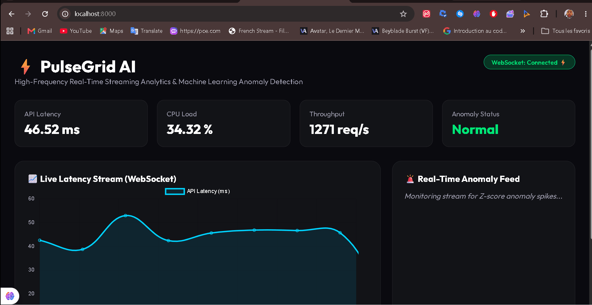

# PulseGrid AI 🚀

<div align="center">
  
  <p><em>PulseGrid AI - Real-Time Streaming Analytics & Anomaly Detection Engine</em></p>
  
  <br />
      
</div>

---

## 🇬🇧 English

### 📖 About the Project
PulseGrid AI is a high-frequency real-time streaming analytics & ML anomaly detection engine powered by FastAPI, WebSockets, Redis, and Z-Score statistics.

### ✨ Key Features
- ⚡ Low-latency WebSocket data stream
- 🧠 Statistical Z-score & ML anomaly detection
- 📊 Live Chart.js dynamic dashboard
- 🐳 Docker-Compose architecture with Redis caching
- 🛡️ Enterprise security (Rate limiting & connection safeguards)

### 💻 Getting Started
```bash
python -m venv venv
venv\Scripts\activate
pip install -r requirements.txt
python app.py
```

---

## 🇫🇷 Français

### 📖 À propos du projet
PulseGrid AI est un moteur d'analyse de métriques en temps réel et de détection d'anomalies ML propulsé par FastAPI, WebSockets, Redis et statistiques Z-Score.

### ✨ Fonctionnalités clés
- ⚡ Flux de données WebSocket à faible latence
- 🧠 Détection d'anomalies statistique Z-score & ML
- 📊 Tableau de bord dynamique temps réel Chart.js
- 🐳 Architecture Docker-Compose avec cache Redis
- 🛡️ Normes de sécurité (Limitation de débit & gestion des connexions)

---

## 📜 License / Licence
Distributed under the MIT License. Copyright © 2026 **Ricardo Ratovoarisoa**. All rights reserved.

---
<div align="center">
  <sub>Built with ❤️ by Ricardo Ratovoarisoa | AI & Full-Stack Developer</sub>
</div>
